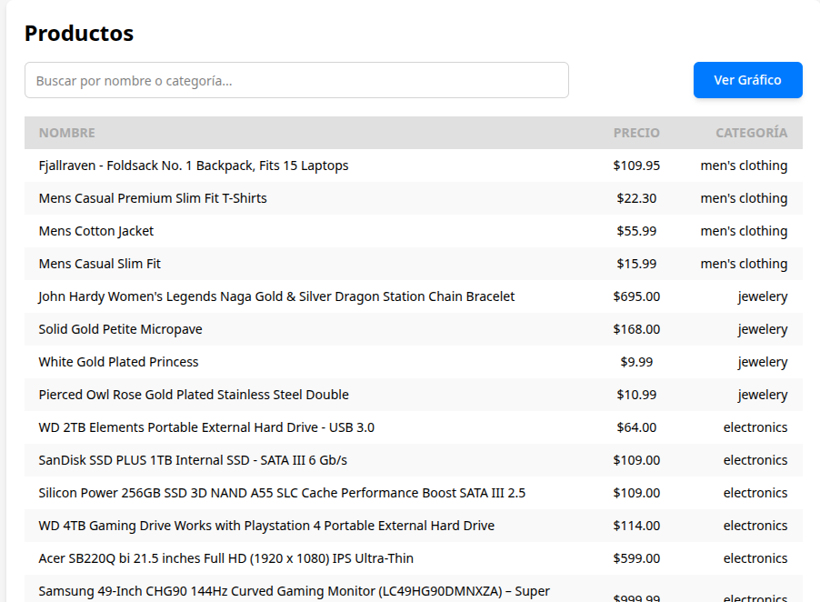
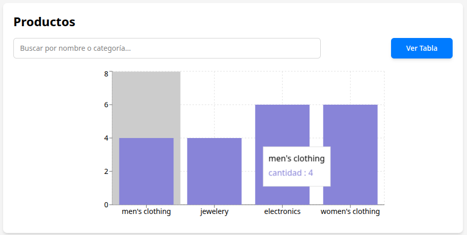

# 📊 Examen - Visualización de Productos

[](https://reactjs.org/)
[](https://vitejs.dev/)
[](https://tailwindcss.com/)
[](LICENSE)

Una aplicación web moderna desarrollada con **React**, **Vite** y **Tailwind CSS** que consume la [FakeStore API](https://fakestoreapi.com/) para mostrar productos en una interfaz interactiva con tabla y gráficos de visualización.

## 🎯 Características Principales

- 📋 **Tabla Interactiva**: Visualiza productos con nombre, precio y categoría
- 📊 **Gráfico de Barras**: Representa la distribución de productos por categoría
- 🔍 **Búsqueda en Tiempo Real**: Filtra productos por nombre o categoría
- 📱 **Diseño Responsivo**: Adaptado para dispositivos móviles y desktop
- ⚡ **Carga Rápida**: Optimizado con Vite para desarrollo y producción
- 🎨 **UI Moderna**: Estilizado con Tailwind CSS

## 🖼️ Vista Previa

### Tabla de Productos

*Tabla responsive con información detallada de cada producto*

### Gráfico de Distribución

*Gráfico de barras mostrando la cantidad de productos por categoría*


## 🚀 Inicio Rápido

### Prerequisitos

Asegúrate de tener instalado:
- **Node.js** >= 16.0.0
- **npm** >= 8.0.0
- Navegador moderno (Chrome, Firefox, Edge, Safari)
- Conexión a internet para la API

### Instalación

1. **Clona el repositorio**
   ```bash
   git clone https://github.com/FERNANDOANGEL202123767/malware.git
   cd malware/examen
   ```

2. **Instala las dependencias**
   ```bash
   npm install
   ```

3. **Inicia el servidor de desarrollo**
   ```bash
   npm run dev
   ```

4. **¡Listo!** Abre tu navegador en `http://localhost:5173`

### Scripts Disponibles

| Comando | Descripción |
|---------|-------------|
| `npm run dev` | Inicia el servidor de desarrollo |
| `npm run build` | Construye la aplicación para producción |
| `npm run preview` | Previsualiza la build de producción |
| `npm run lint` | Ejecuta el linter para revisar el código |

## 🛠️ Tecnologías Utilizadas

### Frontend Core
- **[React 19.0.0](https://reactjs.org/)** - Biblioteca de UI
- **[Vite 6.2.0](https://vitejs.dev/)** - Build tool y dev server
- **[Tailwind CSS 4.1.10](https://tailwindcss.com/)** - Framework de CSS

### Librerías Adicionales
- **[Axios 1.8.4](https://axios-http.com/)** - Cliente HTTP para API calls
- **[Recharts 2.15.1](https://recharts.org/)** - Biblioteca de gráficos para React
- **[PostCSS](https://postcss.org/)** - Transformación de CSS
- **[Autoprefixer](https://autoprefixer.github.io/)** - Prefijos CSS automáticos

### Herramientas de Desarrollo
- **[ESLint](https://eslint.org/)** - Linter de JavaScript
- **[React Plugin](https://github.com/vitejs/vite-plugin-react)** - Plugin de Vite para React

## 📊 API Integrada

Esta aplicación consume la **[FakeStore API](https://fakestoreapi.com/)**, una API REST gratuita que proporciona datos de productos ficticios para desarrollo y testing.

**Endpoint utilizado:**
```
GET https://fakestoreapi.com/products
```

## 🎨 Características de UI/UX

### Diseño Responsivo
- 📱 **Mobile First**: Optimizado para dispositivos móviles
- 💻 **Desktop Ready**: Experiencia completa en pantallas grandes
- 🖥️ **Tablet Friendly**: Adaptación perfecta para tablets

### Interactividad
- 🔍 **Búsqueda Instantánea**: Filtrado en tiempo real
- 🎯 **Hover Effects**: Feedback visual en interacciones
- ⚡ **Loading States**: Indicadores de carga para mejor UX
- 🎨 **Smooth Transitions**: Animaciones sutiles con CSS

### Accesibilidad
- ♿ **Semantic HTML**: Estructura semántica correcta
- 🎨 **Color Contrast**: Colores accesibles según WCAG
- ⌨️ **Keyboard Navigation**: Navegación completa por teclado
- 📱 **Screen Reader Ready**: Compatible con lectores de pantalla

## 🤝 Contribuciones

¡Las contribuciones son bienvenidas! Si quieres contribuir:

1. **Fork** el repositorio
2. **Crea** una rama para tu feature: `git checkout -b feature/nueva-funcionalidad`
3. **Commit** tus cambios: `git commit -m 'Add: nueva funcionalidad'`
4. **Push** a la rama: `git push origin feature/nueva-funcionalidad`
5. **Abre** un Pull Request

### Estándares de Código
- Usa **ESLint** para mantener la consistencia
- Sigue las convenciones de **React Hooks**
- Comenta el código complejo
- Agrega tests si introduces nueva funcionalidad

## 📄 Licencia

Este proyecto está bajo la Licencia MIT. Ver el archivo [LICENSE](LICENSE) para detalles.

## 👤 Autor

**Fernando Angel**
- GitHub: [@FERNANDOANGEL202123767](https://github.com/FERNANDOANGEL202123767)


**⭐ Si este proyecto te fue útil, ¡dale una estrella! ⭐**
